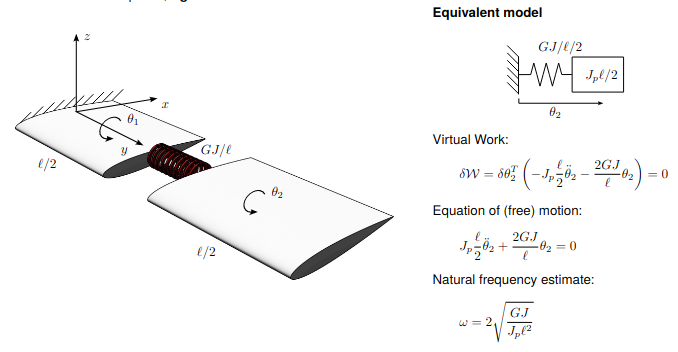
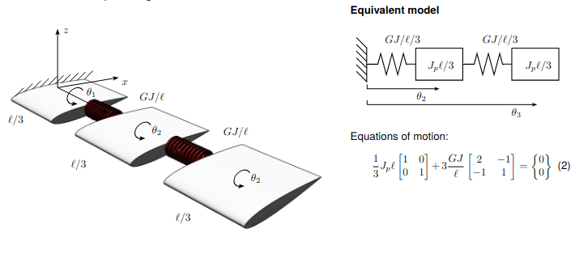
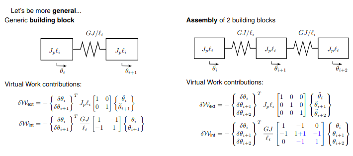

# Notes Exercitation 24-02

Let's consider a cantilever, **straight wing** subjected to **pure torsion**

### Continuum meechanics approach:
Infinitersimal chunk equilibrium, the internal torsion moment linear with the torsion deformation.\
**Indefinite equilibrium** equation $M_y=GJ\theta_{/y}$  solving this equation we will find frequencies and mode shapes.

We can consider a simplified **rigid** model divided in two parts, one connected to the wall and the second connected to the fixed one with a spring in the middle of the wing.

We now split the domain considering also the first part and assigning internal and external forces to the system. The $i$ is the lenght of a single piece. 

From this model we can add other pieces of wing to define it completely. We have to add new elements to the matrix and in the end we can add the clamp constrain at the wing root eliminating the firs rotation from the degrees of freedom eliminating the first row of matrix M and K.

$$
M=J_p l_i\left[
\begin{matrix}
1 & 0 & 0 & ... & 0\\
0 & 1 & 0 & ... & 0\\
0 & 0 & 1& ... & 0\\
\vdots & \vdots & \vdots & \ddots & \vdots \\
0 & 0  &  0 & ... & 1
\end{matrix}
\right]
$$

$$
K=\frac{GJ}{l_i}\left[
\begin{matrix}
1 & -1 & 0 & 0 &... & 0\\
-1 & 2 & -1 & 0 &... & 0\\
0 & -1 & 2 & -1 & ... & 0\\
\vdots & \vdots & \vdots & \vdots & \ddots & \vdots \\
0 & 0 & 0 & -1 & 2 & -1\\
0 & 0  &  0&  0 & -1 & 1
\end{matrix}
\right]
$$
$K\in \R^{N\times N}$

### WIth clamp
we have a matrix with one less row and one less column
$K\in \R^{(N-1)\times(N-1)}$
$$
K=\frac{GJ}{l_i}\left[
\begin{matrix}
2 & -1 & 0 & 0 &... & 0\\
-1 & 2 & -1 & 0 &... & 0\\
0 & -1 & 2 & -1 & ... & 0\\
\vdots & \vdots & \vdots & \vdots & \ddots & \vdots \\
0 & 0 & 0 & -1 & 2 & -1\\
0 & 0  &  0&  0 & -1 & 1
\end{matrix}
\right]
$$