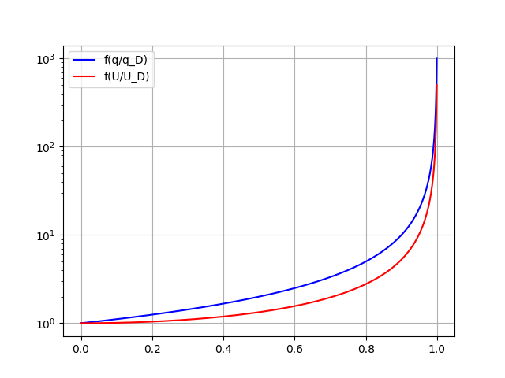

# NOTES: 27th February 20223

### Forum exercises explanation

* Typical section hinged at the leading edge
    * The distance between the elastic axis and the areodinamic acis is negative $e<0$, remembering the dynamic pressure divergence equation $q_D=\frac{K_\alpha}{SecC_{L\alpha}}$. 
    * We see that the divergence dynamic pressure is negative, this has no physical sense. Thi type of section will never diverge since negative dynamic pressure doesn't exist.
* Typical section inged at the trailing edge
    * In this case we will have a positive $e>0$ so we will have a positive $q_D>0$. This section will diverge at a very low $q_D$ since the value of $e$ is very high.

## Torsional divergence

$$
\begin{equation}
\theta = \frac{M_0}{k_\alpha - qK_A} 
\end{equation}
$$

$$
\begin{equation}
\theta = \frac{M_0}{k_\alpha}\left(\frac{1}{1-q\frac{k_A}{k_\alpha}}\right)
\end{equation}
$$

$if\quad q\frac{k_A}{k_\alpha}\rightarrow \quad then \quad \theta\rightarrow\infty$

When the denominator tend to zero the torsion angle tent to become infinitely large and so airfoil “diverges”.

### Aeroelastic performance index

Consider an initial moment M0 applied to the structure, the deformation obtained by the elastic system will be $\theta = \frac{M_0}{k_\alpha - qK_A}$

The deformation obtained by the AEROELASTIC system
will be

$$
\begin{equation}
\frac{\theta}{\theta_0}=\frac{1}{1-\frac{q}{qD}}
\end{equation}
$$
The more $q$ is close to $q_D$ the higher will be the incidence of aeroelastic effects.

### Comparison of aeroelastic and rigid lift

$$
\begin{equation}
L_R = qSC_{L0}=qSC_{L\alpha}\alpha_0
\end{equation}
$$

$$
\begin{equation}
L=qSC_{L\alpha}(\alpha_0+\theta)
\end{equation}
$$
$$
\begin{equation}
M_0 = qSc(C_{m_{CA}}+\frac{e}{c}C_{L0})=eqScC_{M0}
\end{equation}
$$

$$
\begin{equation}
\theta=\theta_0\frac{1}{1-\frac{q}{qD}}
\end{equation}
$$

$ $

$$
\begin{equation}
\frac{L-L_R}{L_R} = \frac{(\alpha_0 - \theta)-\alpha_0}{\alpha_0} = \frac{\theta}{\alpha_0} = \frac{\theta_0}{\alpha_0}\left(\frac{1}{1-\frac{q}{q_D}}\right)
\end{equation}
$$

#### Changing of the $C_{L\alpha}$ curve
$$
\begin{equation}
L = qSC_{L\alpha}\alpha_0\left(1+\frac{\theta_0}{\alpha_0}\frac{1}{1-\frac{q}{qD}}\right)
\end{equation}
$$
The equation above show that we will have an increase in the slope of the $C_{L\alpha}$ curve, since the aeroelastic part of the equation has a positive effect on the lift.

### Torsional divergence as static stability problem

**Static stability**: taken a system that is in equilibrium, the
equilibrium is said **statically stable** if given a slight perturbation to the equilibrium there is a **tendency to return** to the equilibrium.

Consider the aeroelastic moment applied as a nonlinear function of:

$$
\begin{equation}
M_{AE} = f(\theta,q) \quad \quad M_{AE} = f(\theta_T,q) = 0
\end{equation}
$$
$$
\begin{equation}
\theta = \theta_T + \Delta \theta
\end{equation}
$$

Linearizing the system:

$$
\begin{equation}
M_{AE}= f(\theta,q)  \approx f(\theta_T,q) + \frac{\partial f}{\partial \theta}\Delta\theta
\end{equation}
$$
Stable if 
$$
\begin{equation}
\frac{\partial f}{\partial \theta} < 0
\end{equation}
$$

$$
\begin{equation}
M_{AE}= (qSeC_{L0}+qScC_{m_{CA}}+qSeC_{L_\alpha}\theta)-k_\alpha\theta
\end{equation}
$$

$$
\begin{equation}
\begin{cases}
M_{AE}= f(\theta,q) \\
-qSeC_{L0}-qScC_{m_{CA}}+(qSeC_{L_\alpha}-k_\alpha)\theta_T=0
\end{cases}
\end{equation}
$$

The perturbation of thi nonlinear system is

$$
\begin{equation}
\frac{\partial f}{\partial \theta}\Delta\theta=(qSeC_{L\alpha}-k_\alpha)\Delta\theta
\end{equation}
$$

To be stable $\frac{\partial f}{\partial \theta}$ this equation should be negative. The critical condition that transforms the system from stable to unstable is $\quad k_\alpha-qeSC_{L\alpha}$.

$$
\begin{equation}
q_D = \frac{k_\alpha}{eSC_{L\alpha}} = \frac{k_\alpha}{k_A}
\end{equation}
$$

### Torsional divergence as Eigenvalue problem 

Since $\theta_T$ is an equilibrium conditon, we expect at that condition that 
$$
\begin{equation}
(k_\alpha-qeSC_{L\alpha})\Delta\theta=0
\end{equation}
$$
This is an homogeneous equation that has a trivial solution that is $\Delta\theta = 0$. However, when $(k_\alpha-qeSC_{L\alpha})=0$ any $\Delta\theta \neq 0$ will be valid.

This type of problem should recall you an
EIGENVALUE problem, where q are the eigenvalues
of the system that lead to a nontrivial solution of the
homogeneous problem